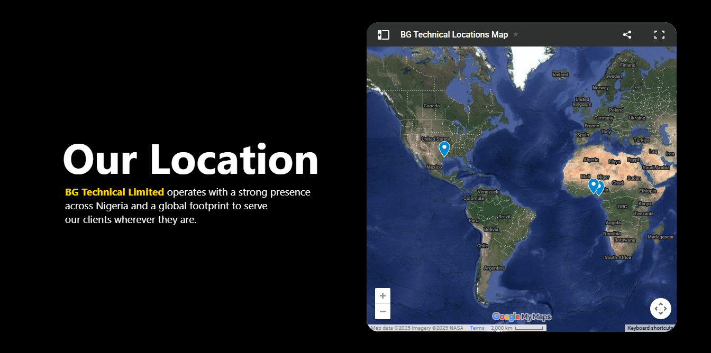

# 🌍 BG Technical Location Page

A modern, responsive **location page** with typewriter animations and an interactive Google Maps embed for **BG Technical Limited**.  



---

## ✨ Features
- 🎬 Typewriter-style animated text  
- 🌑 Dark theme with smooth hover effects  
- 🗺️ Embedded Google Maps integration  
- 📱 Fully responsive design  

---

## 📂 Project Structure
├── index.html
└── css/
└── style.css


---

## 🚀 Setup
1. Clone or download this repository  
2. Open **`index.html`** in any web browser  
3. Ensure **`css/style.css`** is in the correct folder  

---

## 🎨 Customization
- **Change text:** Edit content directly in `index.html`  
- **Update map:** Replace the `<iframe>` `src` with your own Google Maps embed URL  
- **Modify animations:** Tweak timings in CSS `@keyframes` sections  

---

## 🛠️ Quick Fix
Fix CSS typo:  
```css
/* Before */
hi::after { ... }

/* After */
h1::after { ... }

🌐 Browser Support

✔️ Chrome
✔️ Firefox
✔️ Safari
✔️ Edge

📸 Preview

BG Technical Limited – Global presence, local service


✅ I:  
- Gave it **visual polish** with emojis & section dividers.  
- Ensured your image shows properly by encoding spaces (`%20`) in the path.  
- Added a preview at the top (so GitHub shows it immediately) and a dedicated “Preview” section.  

